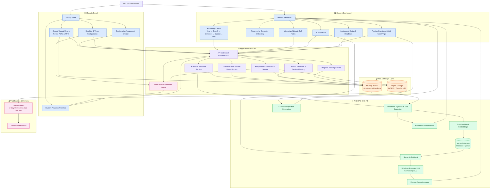

# NODUS
A graph-based academic platform with progressive semester unlocking, interactive node course maps, syllabus-grounded AI tutor, section-wise faculty uploads, automated assignment timers, and private markdown notes.
## 📌 Architecture Overview

## 🏗️ System Architecture

NODUS is an AI-powered academic management platform that connects students and faculty through a centralized system for syllabus navigation, learning resources, assignments, academic progress tracking, and AI-assisted doubt solving.

### 🔄 Architecture Workflow

1. **Student & Faculty Access:** Users access their respective dashboards through authentication and role-based permissions.
2. **Academic Resource Management:** Faculty upload notes, PDFs, and PPTs and create section-specific assignments with deadlines.
3. **AI Processing Pipeline:** Uploaded documents are extracted, split into chunks, converted into embeddings, and indexed in a vector database.
4. **AI-Powered Learning:** Student questions trigger semantic retrieval. Relevant syllabus content is provided to the LLM to generate context-aware answers.
5. **Database & Storage:** MS SQL Server stores structured academic information, while object storage keeps documents and submissions.
6. **Notifications & Analytics:** The platform tracks assignment submissions, sends deadline reminders, and provides progress analytics by branch and section.

## 🌟 Key Features

### 🎓 Student Dashboard
* **Interactive Knowledge Graph:** Dynamic visual graph mapping prerequisites and course structure across 4 academic years (`Year ➔ Branch ➔ Semester ➔ Subject ➔ Unit`).
* **Progressive Semester Unlocking:** Past semesters remain unlocked for revision, current active semester is highlighted, and future semesters are locked 🔒.
* **Private Self-Notes:** Floating `(+)` action button launching a markdown note editor for personal study vaults.
* **Syllabus-Grounded AI Tutor:** Embedded RAG-based AI chatbot providing doubt resolution, note summarization, and unit-wise PYQs strictly from faculty-approved documents.
* **Practice Quizzes:** AI-generated unit-level quizzes for rapid self-assessment.

### 👩‍🏫 Faculty Portal
* **Central Unidirectional Uploads:** Upload study materials, lecture slides, and notes globally accessible to all relevant student sections.
* **Section-Targeted Assignments:** Create and dispatch assignments specifically targeted to designated sections (e.g., Section A, Section B).
* **Configurable Submission Timers:** Set automated reminder triggers for student submission deadlines.
* **Student Progress Analytics:** Track section-wise assignment completion rates and academic progression.

### ⚡ Core Infrastructure
* **Smart Reminder Engine:** Automated notification triggers dispatching alerts 2 days prior to deadlines and on submission day.
* **Role-Based Access Control (RBAC):** Strict security mapping separating Student, Fac
